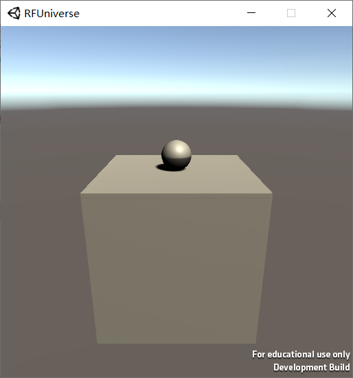

# Balance Ball Environment

## Introduction

Balance ball environment includes a cube and a ball. In each episode, the cube will be initialized as a random pose, 
with the ball falling from a fixed height. In this environment, the cube is the agent. In each time step, cube can 
rotate (-2, 2) degree by X-axis and Z-axis. 



## Usage

[Workspace folder](../demos/balance_ball_env)

Before running any python code, make sure Unity Editor has been open, with `BalanceBall` scene in use. After running 
any code, press `Run` button in Unity Editor so that Python and Unity will be able to communicate with each other.

To visualize balance ball environment, run
```shell
python vis_balance_ball_env.py
```

To train agent in balance ball environment, run
```shell
python train_balance_ball_env.py --timesteps 10000
```

To evaluate the trained agent after training, run
```shell
python eval_balance_ball_env.py
```

## Resources

C# file: [BalanceBallAgent.cs](../RFUniverse/Assets/Scripts/Agent/BalanceBallAgent.cs)

Python file: [balance_ball_env.py](../py-rfuniverse/pyrfuniverse/envs/balance_ball_env.py)
