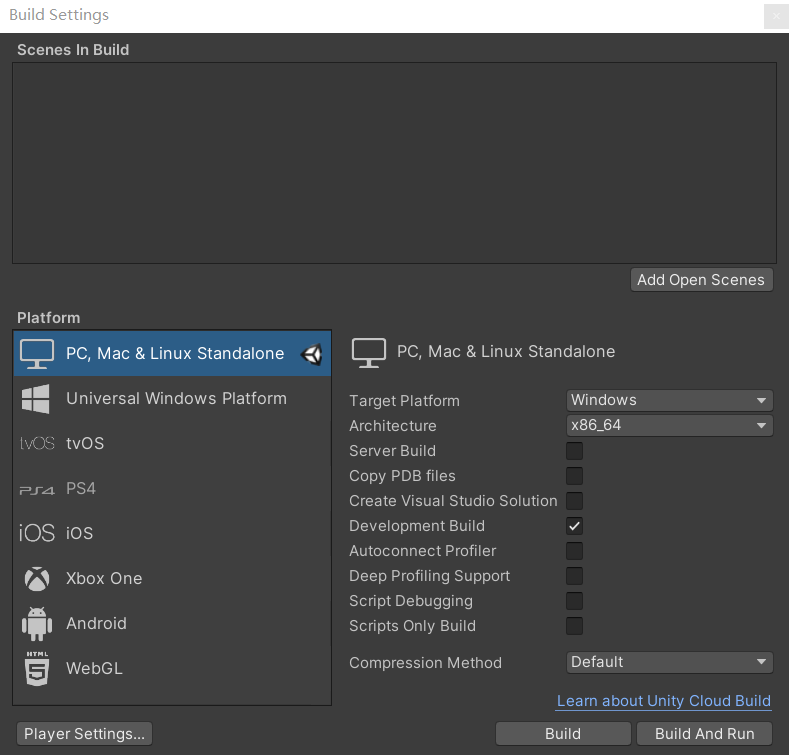

# Build Unity executable file

With Unity Editor, we have already been able to train or test simulation environment. However, we
can only use exactly one Unity Editor and launch exactly one scene at one time. If we are training
an agent in a scene, we will not be able to work on other scenes. Thus, Unity Editor is a useful 
debug tool but not suitable for long-time training. 

Using an executable has some advantages over using the Editor:

* You can exchange executable with other people without having to share your entire repository.
* You can put your executable on a remote machine for faster training.
* You can use Server Build (Headless) mode for faster training (as long as the executable does not
  need rendering).
* You can keep using the Unity Editor for other tasks while the agents are training.

In this tutorial, we will transfer a simulation environment into an executable file with the help 
of Unity Editor. We will take our demo `Roller` environment as an example, and build this scene 
into executable file. 

## Building the Roller environment

1. Open `Roller` scene at folder `Assets/Scenes`.
   
2. Open Player Settings (menu: **Edit > Project Setting > Player**)
   
3. Under **Resolution and Presentation** option, make sure **Run In Background** is checked. Then
   close this dialog.
   
4. Goto menu: **File > Build Settings...** and select your target platform. If your target platform
   is not shown in options, it means you haven't installed such module.
   - (Optional) If you want the headless mode (no rendering), check **Server Build**.
   - (Optional) If you want to see log information, check **Development Build**.
    
5. Notice the **Scenes in Build** list at the top of this dialog. If there are one or multiple scenes
   in the list, make sure only `Roller` scene is checked. If there's no scene in list, then it's OK,
   just ignore this.
   
6. Click **Build** and start building executable file. Remember the path where you save your 
   executable file. Notice that you should make an empty folder for the executable file.



## Interacting with executable environment

To visualize `Roller` environment, you can pass the path of your executable file with the argument 
'executable_file' to `RollerEnv`. Here's an example:
```python
from pyrfuniverse.envs import RollerEnv
env = RollerEnv(executable_file=YOUR_EXECUTABLE_PATH)
```
