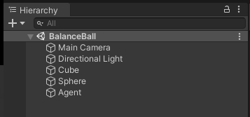
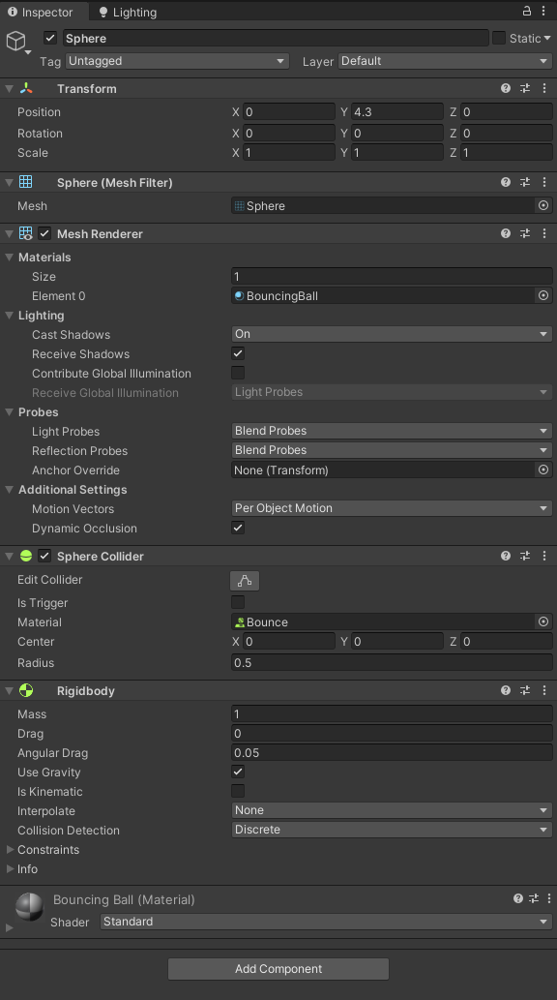
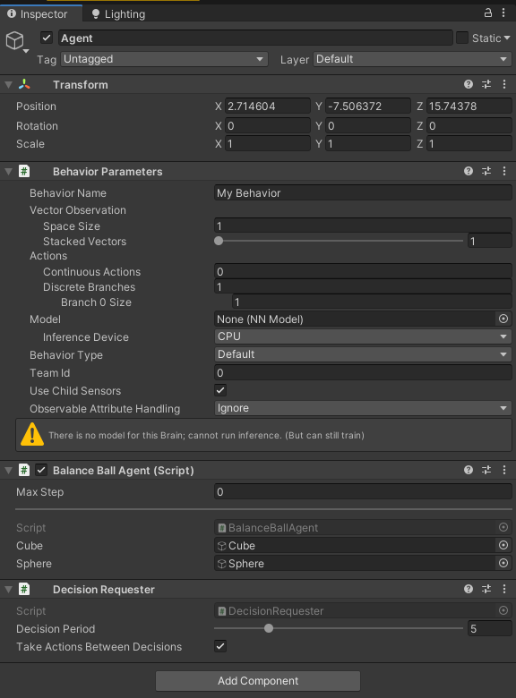

# Create custom environments in RFUniverse

In this tutorial, we will walk through the process of creating a new custom environment in RFUniverse and control this 
environment using python. After reading this tutorial, you should be able to create any environment you want. Before 
reading this tutorial, please make sure you've installed `pyrfuniverse` and downloaded the Unity project. In this 
example, we will create a scene named `BalanceBall`.

## Unity-end

In RFUniverse, an environment will be bound up with a scene in Unity project. In most time, a scene will only be used 
once. Thus, let's first create a scene in Unity and add compulsory components.

### Create objects in scene

First, open the Unity project in Unity Editor. In Unity project, under `Assets/Scenes`, create a new scene named 
`BalanceBall`. For scene `BalanceBall`, we need a `cube` as a rotation-free ground, together with a `sphere` which will 
fall along the falling side of `cube`. Obviously, the `cube` here is the agent. We will use RL algorithm to predict the 
rotation of `cube`.

Second, create the `cube` and `sphere` in this scene. Right click in `Hierarchy` window, and select `3D Object` to 
create a `Cube` and a `Sphere` respectively. 

Finally, create an empty game object by choosing `Create Empty`, then rename it as `Agent`. It is some kind of 
controller in this scene. All interactive information will be passed to `Agent`, then it will control other objects
obeying instructions or actions from python-end. This is the key feature of `RFUniverse`.

Now, your `Hierarchy` window should be like this.

### Modify components and attributes of objects

Click `Main Camera`, and you will see its `components` from `Inspector` window. Under `Transform` option, change 
`Position` to (0, 5, -10) and `Rotation` to (20, 0, 0).

Click the `Cube`, and you will see its `components` from `Inspector` window. In `Transform` option, change 
`Position` and `Rotation` both to (0, 0, 0), while change `Scale` to (5, 5, 5).

Click `Sphere`. Under `Transform` option, change `Position` to (0, 4.3, 0). Under `Mesh Renderer`, find the `Material`
tag and `element 0` option, drag the `BouncingBall` material from `Assets/Materials` folder here. After this, you will 
see the ball changes its texture. Under `Sphere Collider`, drag the `Bounce` physical material from 
`Assets/Materials/PhysicalMaterials` folder to `Material`. Finally, at the bottom of `Inspector` window, click `Add
Component` button and search `Rigidbody`. The final status of `Sphere` will be like the following image.

Actually, all modifications above are subjective. You can modify any of them as you like, since these modifications will
not influence the work of simulation environment.

### Add compulsory components for `Agent`

Click `Agent`. Click the `Add Component` button at the bottom of `Inspector` window, and search 
`BalanceBallAgent.cs`. Add this script to `Agent`. This script can accept instructions and actions from python-end and 
control objects in current scene. In `Inspector` window, find `Balance Ball Agent` option, and drag `Cube` to 'Cube'
and `Sphere` to 'Sphere'. This will let this script know which objects it should control.

Then click `Add Component` again and search `DecisionRequester.cs`. Add this script to `Agent` again. This is an 
auxiliary script. The final status of `Agent` should be like the following image.

For all Unity-end environments in `RFUniverse`, `Agent` will have such scripts. The only difference is their 
`XXXAgent.cs` script. For how to write a custom `XXXAgent.cs` script, please refer to [How to write custom agent script
in Unity](./write_custom_agent_script_in_unity.md).

## Python-end

In python end, we have provided a set of tools to interact with the environment in Unity. During develop stage, you can
debug and test environment in `Unity Editor`. During training, we recommend using executable file, which is more 
flexible.

Simulation environments in python end use [OpenAI-GYM](https://github.com/openai/gym) style. Users need to implement
specified functions to support RL training. More details on creating environment in python can be found in this 
[tutorial](./create_environment_in_python.md).

In this example, the agent is `Cube`, with two values inferring X-axis rotation and Z-axis rotation. Thus, action space 
is 2-d array. Observation in this example includes 8 dimensions, inferring `Cube`'s X-axis rotation and Z-axis rotation 
(2-d), `Sphere`'s position (3-d), and `Sphere`'s velocity (3-d). This process can be found in _get_obs().

In RFUniverse, python end uses `rfuniverse_channel` to interact with Unity. Thus, both step() and _get_obs() functions
will strongly rely on these channels.

Full codes will be found [here](../py-rfuniverse/pyrfuniverse/envs/balance_ball_env.py). Besides, this 
[tutorial](./create_environment_in_python.md) is also important to help you understand the work logic of RFUniverse.
