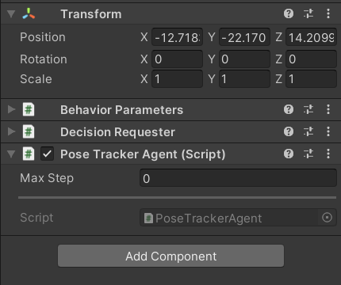

# Create template files automatically

In this tutorial, we will use a tool script in `RFUniverseBaseRoot/scripts/` to automatically generate template files in
both Unity and Python for you to create a new environment. With the template files, we have implemented communication 
between Unity and Python. Based on 
these two template files, you can extend your environment with more complex functions.

We will create a new environment named `pose_tracker_env` as an example in this tutorial.

If you meet any bug in this tutorial, please refer to 
[here](./create_environment_template_files_automatically.md#reference-code) for reference code.

## Usage

```shell
cd rfuniverse/scripts
python create_new_environment.py pose_tracker \
    --py_path ../py-rfuniverse/pyrfuniverse/envs \
    --cs_path ../RFUniverse/Assets/Scripts/Agent \
    --width 512 --height 512  \
    --rigidbody --game_object
```

The example above will create file `pose_tracker_env.py` and `PoseTrackerAgent.cs` at specific path. For other options
in command line, you can refer to this [script](../scripts/create_new_environment.py) for full detail.

## Pose Tracker Environment

Currently, with these two template files, we have been able to communicate between Unity and Python. However, we need
more codes to verify it. Since we call it `pose_tracker_env`, we will go further to track objects' poses in
this environment.

### Add objects in Unity

In this part, we will create a new scene as our environment and add some objects in it. We'll also add some code to template
files to implement this function.

First, open RFUniverse Unity project and create a new scene named `PoseTracker`. In this scene, we need to create an
empty game object which is responsible for communicating between Unity and python, just name it `Communicator`. In 
`Communicator`'s inspector window, add `PoseTrackerAgent` script to it. It will also add another two scripts 
automatically named `Behaviour Parameters` and `Decision Requester`. These two scripts are just auxiliary files, please 
ignore them. After operations above, your `Communicator`'s inspector window should be something like this.



After this, we will add visible objects into this scene. Create a `sphere` and set position to (3, 5, 0). Create a 
`cube` and set position to (-3, 4, 0). Create a `plane` and set position to (0, 0, 0).

We will treat `sphere` and `cube` as rigid body, and `plane` as game object, since it isn't moveable. Thus, in `sphere`
and `cube` inspector window, add `Rigidbody` and `Rigidbody Attr` component. In `plane` inspector window, add \
`Game Object Attr` component. If you get confused to these operations, please refer to 
[this tutorial](create_prefabs_and_assetbundles.md). 

Next, we will build relationship between visible objects above and `Communicator`. We will modify `PoseTrackerAgent.cs`
by following.
We declare two public lists
```cs
public List<GameObject> gameObjects;
public List<GameObject> rigidbodies;
```
so that `sphere`, `cube` and `plane` can be found by this script. Also, since we want `RigidbodyManager` and 
`GameObjectManager` to manage these objects, we need the following code.

```cs
for (int i = 0; i < rigidbodies.Count; ++i)
{
    rigidbodyManager.AddRigidbody(rigidbodies[i]);
}
for (int i = 0; i < gameObjects.Count; ++i)
{
    gameObjectManager.AddGameObject(gameObjects[i]);
}
```
A full version code can be found [here](../RFUniverse/Assets/Scripts/Agent/PoseTrackerDemoAgent.cs).

Then back to Unity Editor, drag visible objects above to where they should be, so that `Communicator`'s inspector window
looks like the following image.


## Modify codes in Python

In every time step, `Managers` in `RFUniverse` will update its objects information to Python. Thus, in each `step()` 
function, we print `data` module. For example, you can do the following modification to `pose_tracker_env.py`

```python
def step(self):
    # In each time step, this function must be called to make sure Unity works well.
    self._step()
    print(self.rigidbody_channel.data)
```

Of course, you can also print data in `game_object_channel`.

## Run this demo

Until now, you have finished all preparation in running this pose tracker demo. Just copy the following code to 
`main.py` and run it.

```python
from pyrfuniverse.envs.pose_tracker_env import PoseTrackerEnv

if __name__ == '__main__':
    env = PoseTrackerEnv(None)
    while 1:
        try:
            env.step()
        except KeyboardInterrupt:
            env.close()
            exit()
```

After running it, press `Run` button in Unity Editor. You will see `sphere` and `cube` falling down to `plane`, and
your terminal will print data information continually until you press `Ctrl + C`.

## Reference code

Unity scene name: PoseTrackerDemo

Python file: [pose_tracker_demo_env.py](../demos/pose_tracker_demo_env/pose_tracker_demo_env.py),
[main.py](../demos/pose_tracker_demo_env/main.py)

C# file: [PoseTrackerDemoAgent.cs](../RFUniverse/Assets/Scripts/Agent/PoseTrackerDemoAgent.cs)
