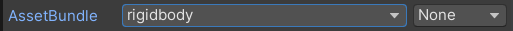

# Create prefabs and asset bundles

When you are doing simulation environments, you may need the function like loading and destroying 
objects in current scene dynamically. In RFUniverse, we follow Unity-style to design objects into 
`prefabs`, which include object name, default transformation, mesh, collider, scripts, attributes, 
etc. After a prefab has been made, we offer tools to build prefabs into `asset bundle`. In Unity, 
asset bundles can be loaded into scene at run time.

## Create prefabs

In RFUniverse, we explicitly discriminate attributes of objects. A prefab must be equipped with 
exactly one script in `Assets/Scripts/Attributes` so that it can be found and controlled by 
`Manager` module. Besides, a prefab must contain attribute component, e.g. a rigidbody prefab must
contain `Rigidbody` component in inspector window of Unity. For other components, you can modify 
their parameters as you like so that the simulation becomes more real. Finally, don't forget to save
your prefab into `Assets/Prefabs` path.

We also provide scripts to make the process of making `prefabs` more easily. You can view menu 
**RFUniverse > Create Prefabs** for more details.

## Build asset bundles

After creating your prefab, you can build it into asset bundle. First, click on the prefab you just
made, and see inspector window of Unity. You need to choose asset bundle group at the bottom.



Just like the image shown above, you can choose any group for your prefab. If there's no such name, 
click `New...` and type in a new name.

After ensuring group, we can click on menu **RFUniverse > Build AssetBundles** and choose the target 
platform. Note that target platform may not be your current platform, but the platform where you 
will run our simulation environment. After some time for compiling, you can find your asset bundle
file at path `Assets/AssetBundles/{YOUR_TARGET_PLATFORM}`.

## How to use asset bundle file: An example

In this example, let's make a prefab and compile it into asset bundle step by step and load it 
into a scene dynamically. All these process can be done in Unity Editor.

Launch Unity and navigate to `Assets/Scenes/` folder. Open `RFUniverse` scene. Then we start to
make a naive prefab.

### 1. Make a prefab

* In Hierarchy window, create a new cube named Test1 and set its position to (0, 5, 0).
  
* Then, make a folder in project window, named `Prefabs`. If you've already made one, just ignore 
  this step.

* Next, drag `Test1` to `Prefabs` folder.
    * If a window is shown to ask you create original prefab or variant prefab, select 
      `Original Prefab`.
      
* In folder `Assets/Prefabs`, double-click on Test1 and you will see inspector window showing 
  Test1's information and current components. Add `Rigidbody` and `Rigidbody Attr` component to it.
  
Until now, this prefab has been successfully made.

### 2. Compile asset bundles

* Click on Test1, and in inspector window, look at the bottom. You will find Test1 doesn't belong to
  any group currently. So you need to manually change it to `rigidbody` group.
  
* Then, goto menu **RFUniverse > Build AssetBundles** to select your target platform and build.

* If noting comes wrong, you should find `rigidbody` file under folder 
  `Assets/AssetBundles/{YOUR_TARGET_PLATFORM}`.
  
### 3. Test its availability

We have provided a script to test the availability at `rfuniverse/tests/test_asset_bundle.py`. At
current stage, please ignore the API and focus on the process of making asset bundles. You can run
```shell
cd rfuniverse/tests
python test_asset_bundle.py
```
Then, in Unity Editor, click `run` button. You should see a cube appear in the scene and fall down
on the floor.
