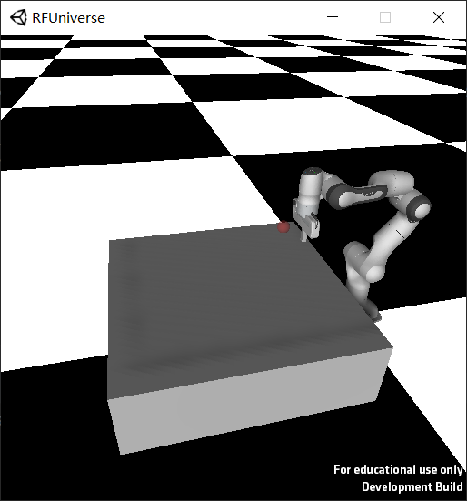

# Franka Robotics Environment

## Introduction

Franka robotics environment is designed for `Franka Emika Panda` robot doing `reach`, `push`, `pick and place` tasks. 
In each episode, robot arm will be initialized with a fixed joint positions, with a random target. In each time step, 
the end-effector of robot arm will move by at most 5cm in each axis relative to current position in Cartesian 
coordinates. At the same time, the gripper will move to the given width (0cm to 8cm).



## Usage

Since we haven't uploaded our Franka model file to GitHub, we offer executable file of `franka_robotcis_env`. Please
download [here](https://pan.baidu.com/s/1hP3t2Y74hireT367C8jhUg) (pin: l2n1) and unzip it to 
`rfuniverse/RFUniverse/Build`.

[Workspace folder](../demos/franka_robotics_env)

Go to workspace folder above, and run
```shell
python vis_franka_robotics_env.py
```
If everything works well, a window will be popped up and you will see `Franka` moving in a circle.

To train agent in franka robotics environment, run
```shell
python train_franka_robotics_env.py --timesteps 10000 --task Reach
```

## Resources

Unity scene: Franka-Robotics
> Unity scene may not be available, since we haven't uploaded model files. We will open-source it later.

C# file: [FrankaRoboticsAgent.cs](../RFUniverse/Assets/Scripts/Agent/FrankaRoboticsAgent.cs)

Python file folder: [robotics](../py-rfuniverse/pyrfuniverse/envs/robotics)
